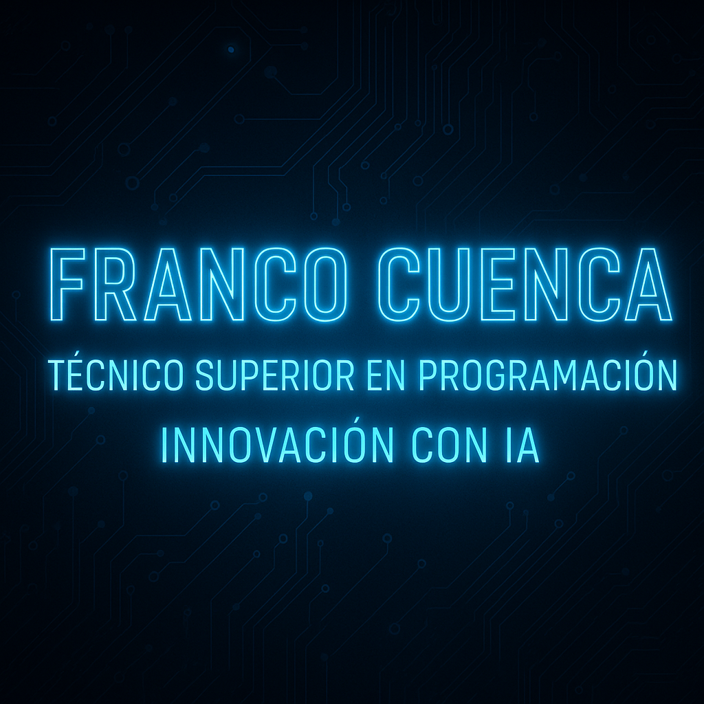

  

<!-- 🚀 PORTAFOLIO - FRANCO CUENCA (TIERRITA) -->

  <!-- Si el banner no existe, podés subir uno local a ./assets/banner-tecprog-futurista.gif -->
  

<h1 align="center">💻 Portafolio — Técnico Superior en Programación</h1>
<h3 align="center">Franco Cuenca | Integrando IA al mundo agro-mecánico</h3>

  
  
  
  

---

## 🧠 Sobre mí

Soy **Franco Cuenca**, estudiante de **Técnico Superior en Programación**.  
Actualmente trabajo en el ámbito **agro-mecánico (Hagie HP204 - Bayer)**, donde combino la lógica de la programación con la precisión de la mecánica.

Mi propósito es claro:  
> **Aprovechar la Inteligencia Artificial y la automatización para optimizar procesos industriales y personales.**

Creo firmemente que la IA es una extensión del ingenio humano; su aplicación puede mejorar desde el campo hasta la ciudad, desde una línea de producción hasta una idea cotidiana.

---

## 🎓 Formación

- 📘 **Técnico Superior en Programación**  
  _En curso_ — enfoque en lógica, desarrollo de software, bases de datos y programación estructurada.  
  Me apasiona conectar el conocimiento académico con la aplicación práctica en entornos reales.

- ⚙️ **Mecánico especializado en equipos agrícolas (Hagie HP204 - Bayer)**  
  Donde aprendí que todo sistema se optimiza cuando entendés su lógica.

---

## 💡 Visión

> “La tecnología no reemplaza al humano. Lo amplifica.”

Basado en **mejora continua**, **aprendizaje constante** y **IA como herramienta universal**.  
El futuro es híbrido: personas + máquinas colaborando para potenciar productividad y creatividad.

---

## ⚙️ Tecnologías que manejo

  

| Categoría | Tecnologías |
|------------|--------------|
| **Lenguajes** | Python, JavaScript, HTML, CSS |
| **Frameworks** | Flask (básico), Bootstrap |
| **Herramientas** | Git, GitHub, VS Code |
| **Cloud & Automatización** | AWS (EC2, S3), IA aplicada |
| **Diseño UX/UI** | Figma, Canva |

---

## 🧩 Proyectos destacados

| Proyecto | Descripción | Estado |
|-----------|-------------|--------|
| **Portafolio Cuenca Franco** | Web personal para mostrar mis habilidades y crecimiento profesional. | ✅ Online |
| **AIONIX** *(secundario)* | Proyecto experimental de IA aplicada al mantenimiento industrial. | 🧠 En desarrollo |
| **Overword** *(secundario)* | Tienda digital con enfoque tecnológico y branding moderno. | ⚙️ Activo |

---

## 🧭 Roadmap personal

- Consolidar Python y lógica de programación.  
- Publicar mi primer portafolio web.  
- Desarrollar un asistente IA simple con Flask y OpenAI API.  
- Integrar IA en entornos industriales (Hagie/Agricultura).  
- Participar en proyectos colaborativos de automatización.  

---

## 🔗 Contacto

  
  
  
  

---

<h4 align="center">🧠 “Aprender, aplicar y evolucionar.” — Franco Cuenca</h4>
<h5 align="center">© 2025 | Portafolio académico y profesional — Integrando IA en el mundo real ⚙️</h5>
